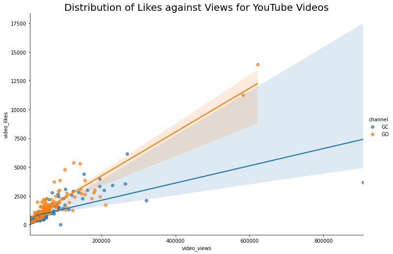
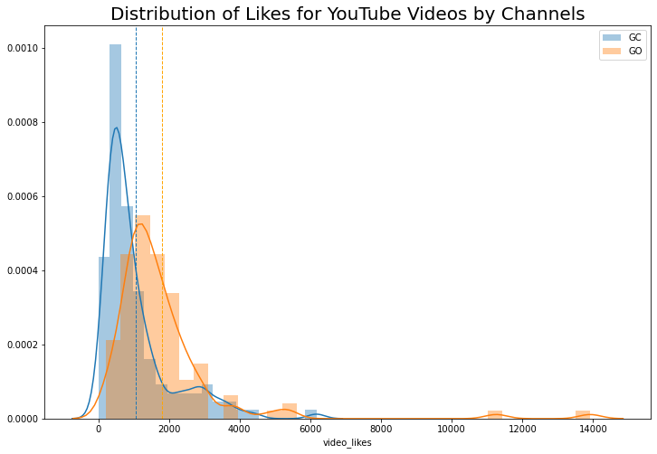
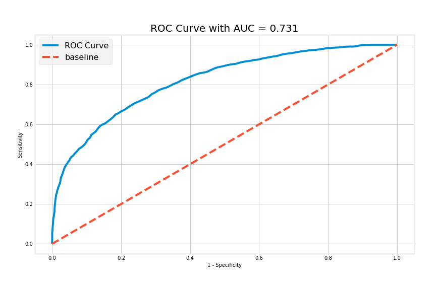
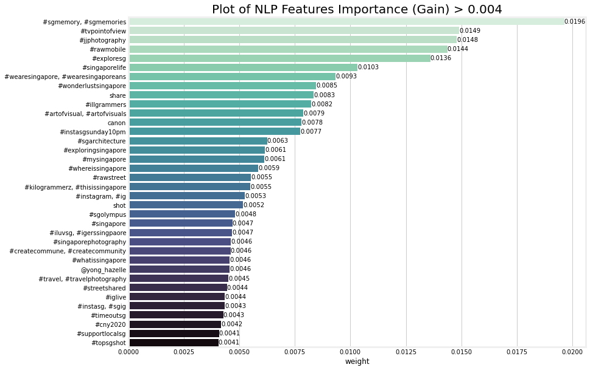
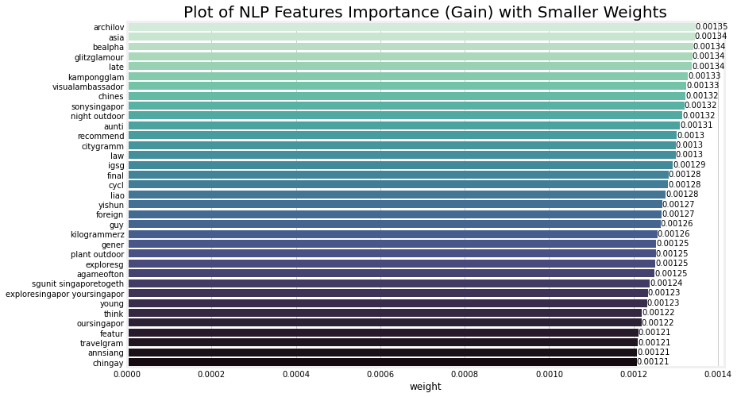
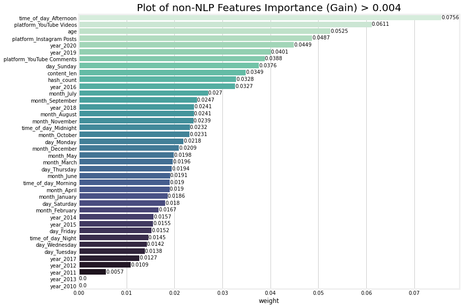
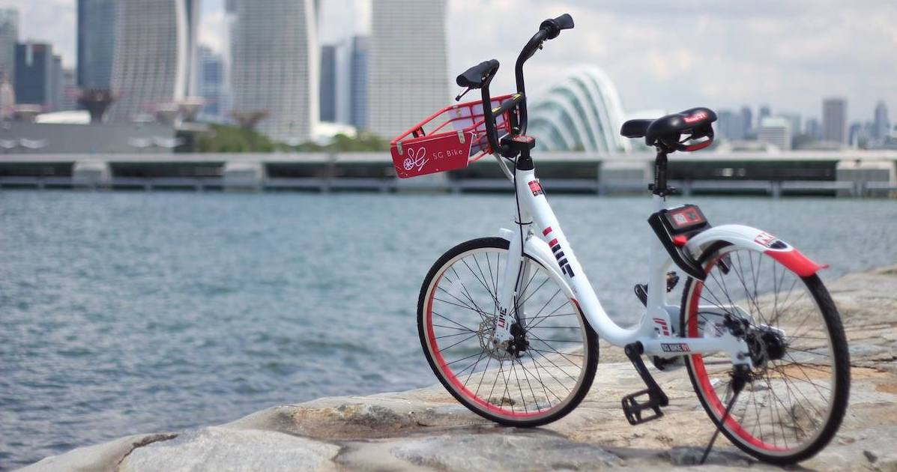
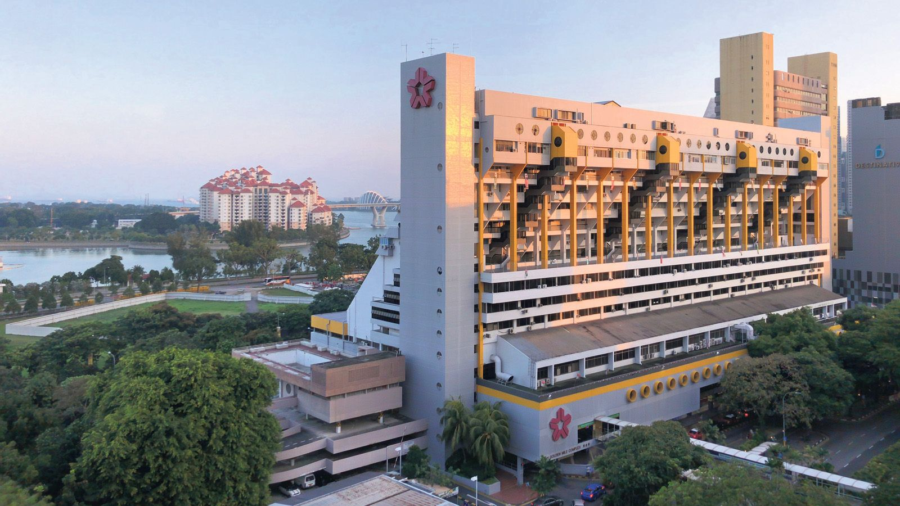
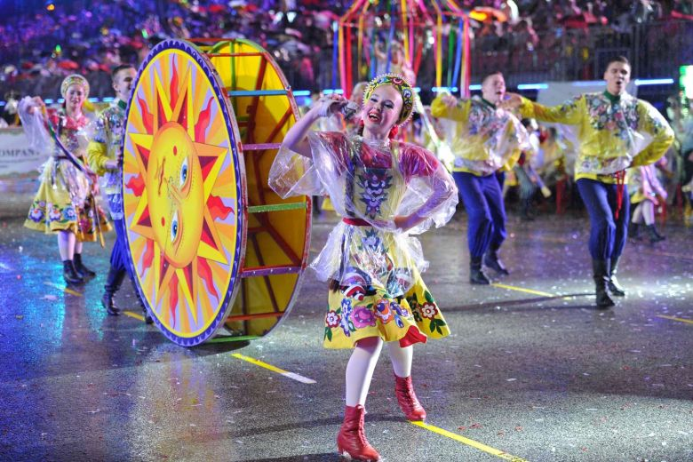

    

## Capstone Project:
# *Tourists* at Home
 

### Overview

In the wake of Covid-19 shuttering airports and devastating the tourism industry, STB and partners have announced the #SingapoRediscovers campaign focused on boosting domestic tourism back home. Recently, [\$100 tourism vouchers](https://www.stb.gov.sg/content/stb/en/media-centre/media-releases/SingapoRediscovers-and-Expanded-Attractions-Guidelines.html) were announced to be given to every eligible Singaporean. Following the announcement, it seems most everyone has begun planning for their next staycation or a trip to the USS. But, is that all there is to domestic tourism? Can we actually grow and sustain domestic tourism in Singapore simply by incentivising local Singaporeans to pick up the slack and participate in activities that are otherwise usually targetted at foreign visitors? How can we best encourage Singaporeans to go out and explore this home of theirs, and to be tourists at home?

These are all questions that this project seeks to answer. We believe that domestic tourism is worth investing in and building up as it will benefit the Singapore tourism industry not just now, but in the long run as well by promoting greater conversations and exchange of narratives between foreign visitors to our home and local exploring their home. By answering these questions, this project hopes that domestic tourism would remain a key focus for STB even when travel has resumed and that it would develop into a robust and active economy.

---

### Executive Summary

Representing STB, this NLP project aims to uncover the Singaporeans' perception of domestic tourism, and to identify key areas of high potential where we can focus our efforts for the next phase of the #SingapoRediscovers campaign. To do this, the project hypothesises that the number of likes attracted by a post/video/comment is indicative of the support and popularity behind the tourism idea. By training our model to predict on the popularity of a video/post, the model learns to rate the attractiveness/reception of a certain idea proposition. After training, inferences can be made from the trained model to inspire proposals for the next phase of the #SingapoRediscovers campaign.

While this project remains primarily an NLP endeavour, non-NLP information were also scraped and subsequently processed for training to improve our model's predictions. As such, our final model design is a hybrid model. Two models were trained separately on NLP and non-NLP features respectively to predict on the same target labels. Their respective prediction probabilities were then aggregated together as a hybrid model before giving us our final predictions. From our modelling process, this aggregation has consistently provided stronger predictions on all metrics, lending weight to our theory that both NLP and non-NLP features contribute in their own way to the model's learning and predictions.

### Content

Please use the following links to get around:

- [Content](#Content)
- [Data](#Data)
- [Analysis and Exploration](#Analysis-and-Exploration)
- [Models](#Models)
- [Conclusions](#Conclusions)

The codes in this project are split across 5 notebooks.

We begin with our first notebook **1.0_DT_Scrape** in which the script can be found for scraping the data points we need for our project. Targetted scrapes were conducted on Instagram and YouTube - target posts on Instagram were found by querying certain target hashtags while videos were found and scraped on YouTube by targetting certain channels.

In the second notebook **2.0_DT_Preprocessing**, the compiled and raw scraped data points were cleaned and formatted. Missing data that requires imputation were also performed here.

In **3.0_DT_EDA**, exploratory data analysis was conducted on our cleaned datasets to uncover trends. Features engineering was also performed along the way, in part to provide further analysis, and in part also to provide new features for our model to train on.

Before building our final model, we will first need to take the half-step of model selection in the fourth notebook **3.5_DT_Model_Selection**. Here, different model designs/builds and algorithms were tested out and the best performing model was identified for further development in the next notebook.

In our fifth and last notebook **4.0_DT_Model**, hyper-parameters were tuned for the selected model before finally building the select model and training it. The results were then evaluated according to certain metrics. Three primary models were built according to different optimisations, and the best model was used for drawing inferences from and inspiring proposals for STB's next phase of #SingapoRediscovers campaign.

---

### Data

[Back to Top!](#Content)

#### Scraped Data

This project aims to uncover the local perception of domestic tourism by scraping from and training on data from Instagram and YouTube. In order to provide actionable insights for STB to focus on for the next phase of their campaign, and to provide a vision of tourism in the new normal, this project hypothesises that the number of likes attracted by a post/video/comment is indicative of the support and enthusiasm behind the tourism idea. The scraping process begins with a few key assumptions that underlie my hypotheses. They are:

- Instagram posts can reveal the **conscious local perception** of domestic tourism made explicit by through hashtagging.
- YouTube videos and comments make up a dialogue that can reveal the **unconscious local perception** of domestic tourism made implicit by local recommendations on exploring Singapore in reaction to the video.
- Locals would follow through on their own recommendations for others.

#### Preprocessing

Data cleaning is an important step to render our data ready for analysis and modelling. Besides reformatting data to its appropriate data type, an important aspect of the preprocessing step is to handle missing data. In the interest of time, not every missing data point was handled. Only features that were selected for use in our models or that can aid our analysis were efforts taken to handle the missing data.

As a general strategy, where subset of data points with missing data is small, we would ignore this small group of data points and drop them from our dataset. If the missing data forms a substantial part of our dataset, we would as much as possible deduce to impute first from available information elsewhere in our datasets. An example would be the missing date-time data for our YouTube comments data points where we deduced that a video would receive most of its comments within 7 days of its publication, and therefore assumed and imputed the video date of publish as also the comments date of publish. Should deductive imputation not be possible, we will then infer our imputation values from its surrounding data points.

#### Data Dictionary

This data dictionary only include features that are relevant to our analysis and modelling process.

|Feature|Data Type|Format|Description|
|---|---|---|:--|
|**content**|string|*discrete*|Relevant text content for each data point were concatenated into a single column feature.|
|**likes**|integer|*continuous*|The number of likes acquired by each data point.|
|**age**|integer|*continuous*|The age of data point in number of days from when it was first published to when it was scraped.|
|**popular**|integer|*binary*|Our target labels for classification indicating if a data point is popular or not. It was engineered by identifying likes outliers using the inter-quartile range of each likes distribution.|
|**date_time**|datetime|*discrete*|Pandas Timestamp objects indicating the date and time of when each data point was published.|
|**year**|integer|*discrete*|Year when each data point was published.|
|**month**|string|*discrete*|Month when each data point was published.|
|**day**|string|*discrete*|Day when each data point was published.|
|**time_of_day**|string|*discrete*|Time of day when each data point was published. This feature was engineered by apportioning four parts to the day and labelling each data point accordingly. We have "Midnight" from 00:00 to 05:59; "Morning" from 06:00 to 11:59; "Afternoon" from 12:00 to 17:59; and "Night" from 18:00 to 23:59.
|**hash_count**|integer|*continuous*|Counts total number of hashtags found in the text content of each data point.|
|**content_len**|integer|*continuous*|Counts total character length of the text content of each data point.|

---

### Analysis and Exploration

[Back to Top!](#Content)

#### Likes

One of the strongest feature we have found to be strongly correlated with likes is the number of views. The above example show YouTube videos as an example. Unfortunately, we do not have the same type of data for Instagram posts and YouTube comments. However, even if these information were available, they would probably best be excluded from the training set as they would inevitably leak information about the respective content's popularity. Even so, it is interesting to note the different gradients and therefore views-likes conversion that exists between the two channels, which brings us to the next chart where we look more closely at the different likes distributions between channels, and indeed different platforms.

#### Features Engineering
    
While exploring our data, we are also inspired along the way to engineer new features that may allow us to access certain specualted relationships between our features and target variable. Examples include features such as `age`, `hash_count`, and `content_len`. But, probably the most important feature engineered in this project was our `popular` target labels - the very target variable our classification model will attempt to predict.

The pivot from a regression data science problem to classification came about in notebook **4.0_DT_Model**. Using the above YouTube videos as an example, the histogram plot shows the vastly different likes distribution that exists even between the different channels on the same platform. The new `popular` target labels were engineered by identifying the outliers within each likes distribution. There were several distributions identified - Instagram posts, YouTube videos by Georgia Caney (GC), YouTube videos by Ghib Ojisan (GO), comments on GC's YouTube videos, and comments on GO's YouTube videos. There exists several heuristics for identifying outliers, but in the end the more generous/less stringent heuristic of finding likes outside of the distribution's 1.5 times inter-quartile range was selected to reduce the imbalance in our classes.

---

### Models

[Back to Top!](#Content)

#### Model Selection

|**Model**|**Cross-Validation Score (R2)**|**Mean Squared Error**|**Validation Score Gap**|**Training Time (s)**|**Training Time (hh-mm-ss)**|
|---|---|---|---|---|---|
|Ridge Regressor*|0.387|58557.4|-|70|1min 10s|
|Support Vector Regressor|-0.035|-|-|3022|50min 22s|
|Random Forest Regressor|0.401|-|-|5305|1h 28min 25s|
|Extra Trees Regressor|0.367|-|-|10306|2h 51min 46s|
|Ada-Boost Regressor|-7.124|-|-|2215|36min 55s|
|Gradient Boosting Regressor|0.363|-|-|587|9min 47s|
|XGBoost (gbtree, squared error) Regressor|0.303|-|-|158|2min 38s|
|XGBoost (gbtree, tweedie) Regressor|0.381|-|-|180|3min|
|XGBoost (gblinear, squared error) Regressor|0.398|-|-|41|41s|
|XGBoost (gblinear, tweedie) Regressor|0.317|-|-|36|36s|
|Feed-Forward NN|-|61421.0|18.1|28|28s|
|Feed-Forward NN (Ridge)|-|61419.7|596.5|27|27s|
|Feed-Forward NN (Lasso)|-|61259.4|541.3|27|27s|
|Recurrent NN (GRU)|-|101920.1|64157.1|1362|22min 42s|
|Recurrent NN (LSTM)|-|90009.7|33145.1|1270|21min 10s|

Models were built using only the top ranking 2500 word features extracted from the `TfidfVectorizer` and 3 dummy columns, one for each of the type of platforms that each word feature subscribe to. A collection of algorithms were cross-validated and scored against. Our priorities during model selection were both its CV scores and its training time. As such, XGBoost was our eventual algorithm of choice since it gave us the second best score in the shortest amount of time. In first place was actually Random Forest, but the training time required for that marginal boost to the score was in orders of magnitude greater than XGBoost parallelised training algorithm.

In this section, other model designs and builds were also tested. It was determined that stemming word tokens, adding platform dummies rather than scaling likes, and removing only target hashtags yield us the better CV score.

#### Final Model

Three XGBoost models were built and optimised in different ways. Their performances are tabled below. During the modelling process, it was decided that the most important error to reduce is to reduce the number of False Positives (FP). This is because in a struggling tourism economy, we should be more conservative and risk-averse in how we allocate our resources and should aim to minimise loss by reducing the FP campaigns that failed to become popular. As such, the metric we want to optimise for should be precision, of F-1 score that maximises both recall and specificity.

|Model|Optimised on|ROC-AUC|Accuracy|Recall|Specificity|Precision|F-1 Score|
|---|---|---|---|---|---|---|---|
|baseline*|-|-|0.709|-|-|-|-|
|Hybrid_01|ROC-AUC|0.727|0.734|0.711|0.743|0.532|0.609|
|Hybrid_02|F-1|0.731|0.735|0.724|0.739|0.533|0.614|
|Hybrid_03|SMOTE, F-1|0.719|0.699|0.765|0.672|0.489|0.597|

*baseline accuracy by predicting all negative/unpopular

Our final model was therefore selected to be Hybrid_02 optimised on the F-1 score as it outperformed all the other models, not just on the F-1 score but also on most other metrics.

Plotted above is the AUC-ROC of Hybrid_02. After optimising our model hyper-parameters on F-1 score, Hybrid_02 is outperforming all other models on all fronts except specificity. This means that Hybrid_02 has a slightly higher misclassification rate of the negative classes, which also means that the number of FN cases is higher. This is acceptable because precision is our prioritised metric and is scored the highest in Hybrid_02.

---

### Conclusions

[Back to Top!](#Content)

#### Findings

Since we have found our best-performing model, let us extract our findings from Hybrid_02. As the model is made by aggregating a NLP and a non-NLP model, our insights are therefore also split that way. 

For our NLP features, it is immediately striking that the majority of these top word features are hashtags. Perhaps it is inescapable as their use on online social media has become ubiquitous, even approaching spam levels in order to attract the eyeballs and attention desired. As such, we must also be wary of how we interpret these word features, especially the hashtags. It is most likely that these are hashtags so overused as an SEO strategy that they have begun to lose meaning and significance, while providing visibility and aiding the our model to make its predictions.

Exploring the lower weighted word features uncovered features that are less hashtags and more key words. Generally, these key words indicate locations of interest - #kampongglam at 0.00133, yishun at 0.00127, annsiang at 0.00121, types of activites - late at 0.00134, night outdoor at 0.00132, cycle at 0.00128, plant outdoor at 0.00125, and cultural focus - #archilove at 0.00135, #glitzglamour at 0.00134, chingay at 0.00121, auntie at 0.00131.

We have a few types of non-NLP features for our model to train on. These are subsequently dummied out. We have the types of platform, the total length of the text feature, number of hashtags used in that data point, the age (in days) of the data point from inception to when it was scraped, as well as all the date-related features such as year, month, day, and time of the day. After dummying, we have a total of 40 features.

Our top ranking meta-feature is `time_of_day_Afternoon` with a weight of 0.0756. Among our platform types, YouTube videos are the most likely to succeed and become popular with `platform_YouTube_Videos` coming in ranked second with a weight of 0.0611. The next platform type most likely to be popular is `platform_Instagram_Posts` at 0.0487 and `platform_YouTube_Comments` at 0.0388. The third ranking feature is `age` of the content with a weight of 0.0525. While this is an important predictor to our model, it should not be understood as a linearly correlated with popularity. Content launched this year - `year_2020` weighted 0.0401, and last - `year_2019` weighted 0.0388, are more likely to be popular too. Generally, we can see that content that are more recent tend to perform better than content that are older.

#### Proposal 1:

- An *Instagram photo cycle* (like a photo walk, but on bicycle) that will encourage the locals to pick up a bicycle and explore different areas and neighbourhoods of Singapore, and to rediscover their hometowns in new light.
- For leisure cycling, most Singaporeans would turn to places like East Coast Park where there are bicycle rentals easily accessible, which is why unless you have your own bicycle, it is uncommon for someone to cycle and explore their neighbourhood. This would be a good opportunity to partner with one/both of the surviving [bicycle providers](https://vulcanpost.com/708823/singapore-bike-sharing-will-it-take-off/#:~:text=In%202017%2C%20Singapore%20started%20seeing%20a%20bike%2Dsharing%20boom.&text=At%20its%20peak%2C%20nine%20bike,more%20than%20200%2C000%20shared%20bicycles.) (SG Bike and Anywheel) and #supportlocalsg.
- We have extensive Park Connector Networks (PCNs) that connect the different regions of Singapore to one another so this is entirely feasible and would encourage usage of these built infrastructure.
- STB can engage the locals with this initiative by releasing checkpoints/destinations or neighbourhood of interest weekly as well as manage a hashtag where locals can post photos of their exploration.

#### Proposal 2:

- A *Pseudo-Travel initiative* within Singapore that will enlighten our locals to the numerous ethnic enclaves that have organically grown in Singapore, and to encourage them to visit and be "tourists" for a day at home.
- As a cosmopolitan city, Singapore is home to many people from all around the world. As foreigners in Singapore, these groups of people would inevitably reappropriate a space and form their own [little ethnic enclaves](https://thefinder.life/healthy-living/ask-the-experts/7-hidden-ethnic-enclaves-singapore-arent-chinatown-or-little/?agallery=24200&aslide=0). Some are well-known and arguably gentrified, such as Little India, Chinatown, and Kampung Gelam. There are others that are just as known but are not officially recognised, such as Lucky Plaza that is Filipino's home away from home; Peninsula Plaza aka Little Burma; Golden Mile Complex aka Little Thailand, Tanjong Pagar or Korean street; Geylang aka New Chinatown; City Plaza for the Indonesians. We would argue that these places are worth exploring and more appealing to locals because they have not been officially recognised and is a quick way to transport yourself to another country within Singapore.
- To encourage Singaporeans to go out and explore these other ethnic enclaves in Singapore, we propose partnering up with Ghib Ojisan (GO) on YouTube for him to explore these enclaves and vlog his experiences on his channel to educate the local viewers and pique their interest.
- GO has acutally already done a [video](https://www.youtube.com/watch?v=_ZQl1eG98iY&ab_channel=GhibOjisan) exploring Lucky Plaza. Of course, there remains more to be explored. But in light of that, we recommend beginning this series with Little Thailand at Golden Mile Complex. Recent news of its [official conservancy status](https://www.channelnewsasia.com/news/singapore/golden-mile-complex-proposed-for-conservation-incentives-13240674) would likely see the optimistic revival of this enclave.

#### Proposal 3:

- A *Chingay behind-the-scenes* YouTube mini-series that follows volunteer performers behind the scenes as they rehearse and prepare themselves over 6 months for the [Chingay](https://www.chingay.gov.sg/) performance (Chingay 2020 was held on Jan 31 and Feb 1).
- This is aimed to boost and create sustained local interest in Chingay by investing the viewers in the jouney of the volunteer performers. Since the mini-series will be episodic, fresh content that is generated periodically will stimulate interest.
- As Chingay is an annual event, it will be a worthwhile pursuit for STB to create and generate the local buzz/interest over Chingay. By creating a new generation of Chingay audience, we will be able build on that momentum year after year. Should travel resume, it would also be a better Chingay with greater local support and interest. For a parade that celebrate multiculturality, it would be a more interesting experience for foreign tourists to spectate alongside local "tourists".     

#### Evaluate Proposals:

We ran each of the 3 proposals through our Hybrid_02 model to predict on their popularity. While they are all predicted to be popular, proposal 3 was predicted to be most likely to be popular with a prediction popularity of 0.695 compared to proposal 1's probability of 0.590 and proposal 2's probability of 0.567. Therefore, of all the initiatives we would recommend proposal 3 most.

 
 
 
Thank you for reading this far. You are awesome!